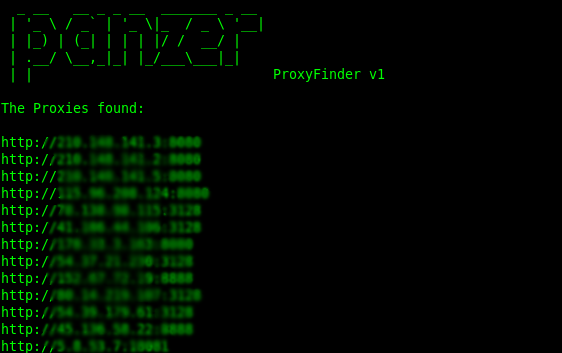

<div align="center">
  <h1>Panzer ProxyFinder v1</h1>
</div>


Panzer ProxyFinder is a command-line tool designed to quickly and easily find public proxies. By searching multiple websites, it can quickly and efficiently compile a list of working proxies that can be used for a variety of purposes, such as web scraping, penetration testing, or anonymity. 

## Usage <br>
To use the script, simply run the following command: <br>
``` bash
bash Panzer.sh
```
The tool will display a list of working proxies it finds. By default, the tool will save the proxies to a file named proxies.txt in the same directory as the script.


## Dependencies
ProxyFinder is written in Bash and uses the following command-line tools:<br>

curl <br>
grep<br>
awk
<br><br>
These tools should be pre-installed on most Unix-based operating systems, but if you encounter any issues, please ensure that these dependencies are installed on your system.
<br>

## Output



## Customizing <br>
You can customize the tool by editing the panzer.sh script. The script uses an array of URLs to search for proxies, and you can add or remove URLs as desired.

## License <br>
ProxyFinder is licensed under the MIT License. Please see the [LICENSE](https://github.com/blue0x1/panzer/blob/main/LICENSE) file for more information.
